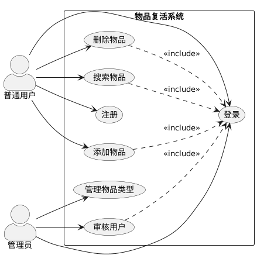
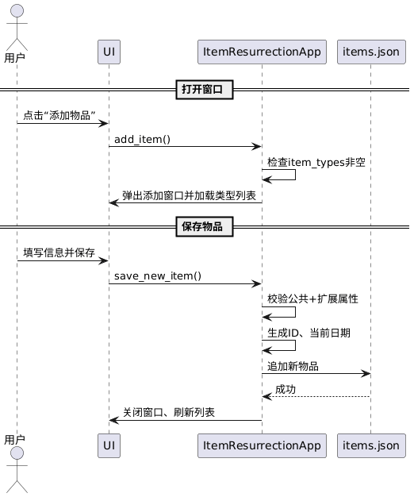
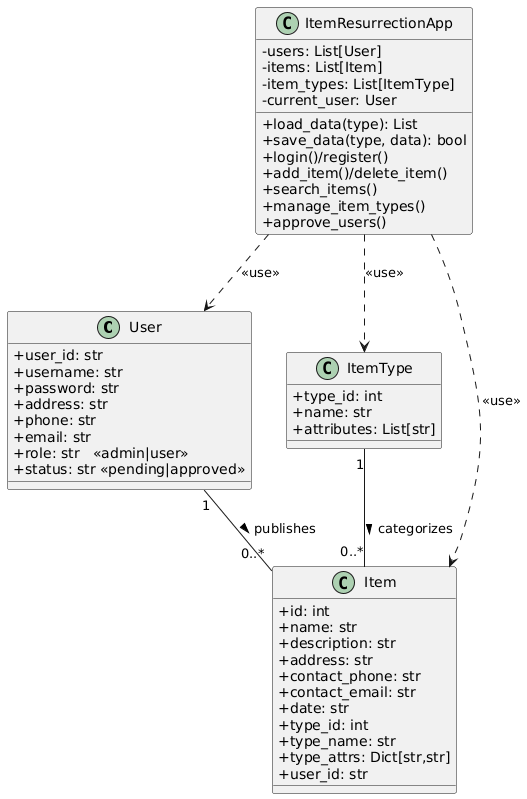

# 《物品复活系统》软件工程文档

> 版本：v2.0  
> 作者：谢建波  
> 日期：2025-11-11  
> 源码 & 文档仓库：https://github.com/dianyuanxiejb/Item_resurrection_2

---

## 1. 用例模型

### 1.1 用例图（PlantUML）



### 1.2 用例描述表（节选 3 个核心用例）

| 用例编号   | UC3                                                          |
| ---------- | ------------------------------------------------------------ |
| 用例名称   | 添加物品                                                     |
| 主要参与者 | 普通用户                                                     |
| 前置条件   | 用户已登录且已批准                                           |
| 后置条件   | 系统中新增一条物品记录                                       |
| 主事件流   | 1. 用户点击“添加物品”<br>2. 系统弹出添加窗口并加载物品类型列表<br>3. 用户选择类型并填写公共信息及扩展属性<br>4. 用户点击“保存”<br>5. 系统校验→生成ID→持久化→刷新列表 |
| 备选流     | 5a 校验失败→提示重新输入                                     |

| 用例编号   | UC5                                                          |
| ---------- | ------------------------------------------------------------ |
| 用例名称   | 搜索物品                                                     |
| 主要参与者 | 普通用户                                                     |
| 前置条件   | 用户已登录                                                   |
| 主事件流   | 1. 用户选择物品类型（可选）<br>2. 用户输入关键字<br>3. 系统按“类型+关键字”过滤并刷新列表 |

| 用例编号   | UC7                                                          |
| ---------- | ------------------------------------------------------------ |
| 用例名称   | 管理物品类型                                                 |
| 主要参与者 | 管理员                                                       |
| 前置条件   | 管理员已登录                                                 |
| 主事件流   | 1. 管理员进入“管理物品类型”<br>2. 系统展示现有类型及属性<br>3. 管理员可新增/修改/删除类型与属性<br>4. 系统保存变更并提示成功 |

---

## 2. 顺序图

### 2.1 添加物品（普通用户）



### 2.2 搜索物品


### 2.3 管理员审核用户


---

## 3. 类图

> 注：为减少篇幅，仅保留与业务强相关的属性&方法；Tkinter GUI 控件未全部列出。



---

## 4. 如何使用本仓库

1. 克隆  
   `git clone https://github.com/dianyuanxiejb/Item_resurrection_2.git`

2. 运行  
   ```bash
   cd Item_resurrection_2
   python main.py
   ```
   默认管理员账号：`admin / admin123`


